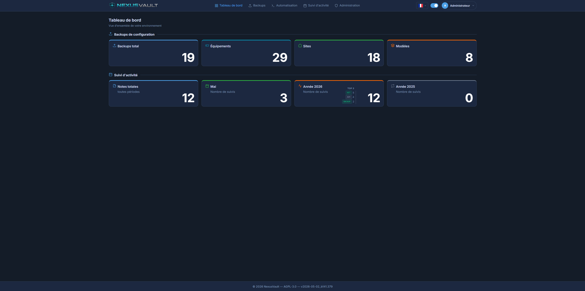
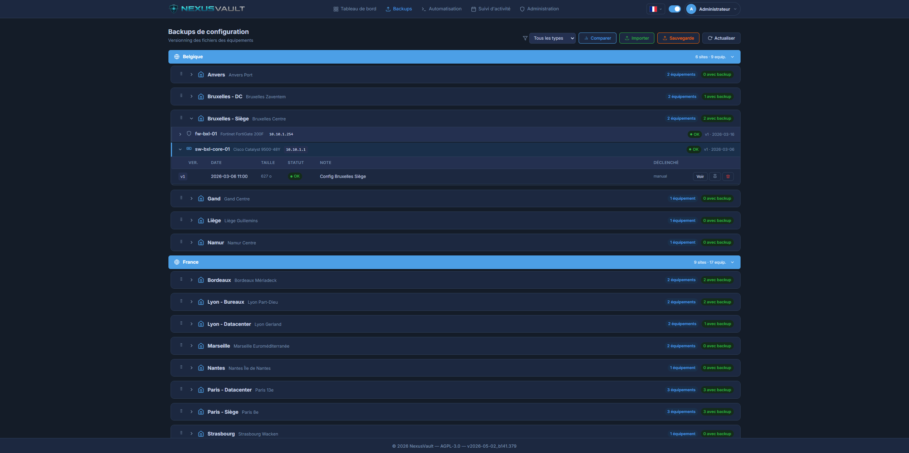
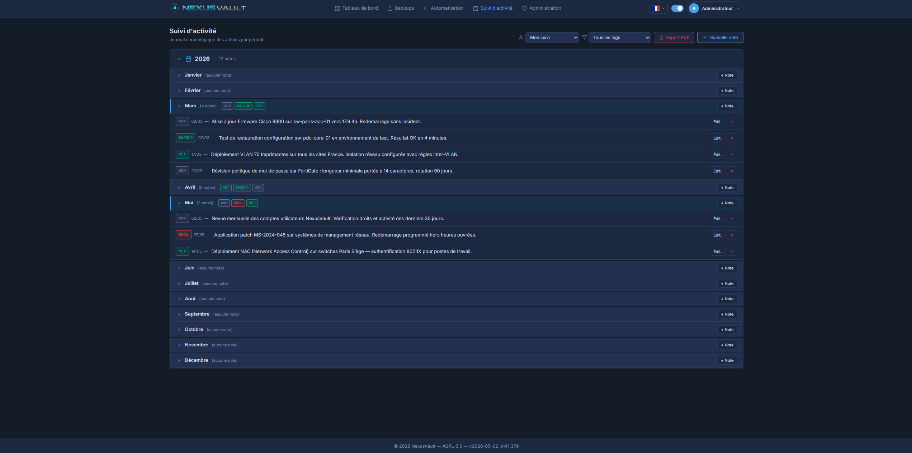
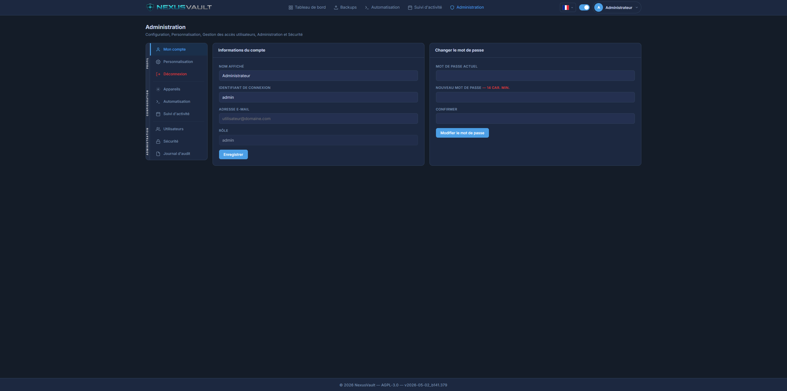

# nexusVault — New EXperience for USer Vault — IT Secure Vault Environment

IT critical element vault interface: network equipment configuration, activity tracking, scripts & automation.

> 🇫🇷 [Version française ici](README.md)

---

## Why nexusVault?

Configuration files, equipment backup files, and IT activity logs are critical assets that should never be stored on a simple file server or NAS.
If compromised, attackers have everything at their fingertips!

---

## Key Features

### Backups
- **Network equipment configuration backup: Switches, NAS, Firewalls, Others**
- **Manual and automatic backup import**
- **Visual diff between two versions (additions in green, deletions in red)**
- **Country, site, equipment and device model management**
- **Optional site grouping by country (enable in Devices → Options)**
- **CSV.gz backup export**

### Activity Tracking
- **IT team activity tracking per user via TAGs with filtering**
- **Custom TAGs with colors: SECU, ADM, NET, BACKUP, INCIDENT…**
- **File attachments per note: upload, lock, delete, download**
- **`[secret]...[/secret]` tag** to mask sensitive data (passwords, keys…) — displayed as `●●●●●` in the list, visible only when editing
- **Cosmetic display date** (Admin → Activity → Options): change the displayed date without affecting the real history
- **CSV import** of historical notes (format `YEAR;MONTH;DAY;TAG;NOTE`, Admin → Activity → Options)
- **PDF export** with custom logo, full content, date and TAG columns
- **Note protection**: TAG deletion blocked if used in notes
- **Mandatory TOTP 2FA** configurable by admin (Admin → Security → Authentication)

### Audit Log
- **Full audit: Login OK/NOK, Add/Delete/View/Edit**
- **Brute-force detection and logging**
- **Automatic monthly archiving (configurable cron: execution time)**
- **Archive browsing by year/month, CSV.gz download**
- **Audited actions: LOGIN_SUCCESS/FAIL/BLOCKED, LOGOUT/TIMEOUT, BACKUP_*, AUDIT_ARCHIVED, SUIVI_IMPORTÉ, LOGO_PDF_MODIFIÉ, TOTP_CONFIGURE, etc.**

### Security
- **Role-based access control (Admin, Operator, Reader)**
- **Configurable brute-force protection: number of attempts and lockout duration**
- **Configurable session timeout with visual countdown and automatic audit**
- **TOTP authentication (Google Authenticator, Authy…) mandatory or optional**
- **Manual account unlock from Admin interface**
- **Dark / light mode**
- **i18n multilingual support (11 languages: fr, en, de, es, it, ja, nl, pl, pt, ru, zh)**
- **LDAP/LDAPS, OIDC authentication *(not tested yet)***
- **Notifications via SMTP, Telegram and Slack *(not tested yet)***
- **AES-256 encryption** of all sensitive data in SQLite database

### Administration
- **User management with lock/unlock, TOTP reset**
- **Configurable application URL**
- **Archiving scheduler (1st of the month, configurable time)**
- **Custom PDF logo** (Admin → Activity → Options, max height 120px)
- **Interface customization *(coming soon)***

---

## Coming Soon

- **GDPR: Element anonymization**
- **Dashboard customization: displayed elements, colors, TOP3, etc.**
- **Full i18n for all pages**
- **Shared multi-user activity tracking with user-identification TAGs**
- **Automation section: script storage by type, environment, tag**

---

## Quick Start

### 1. Prerequisites

- Docker ≥ 20.x
- Docker Compose ≥ 2.x

### 2. Configuration

```bash
# Clone or copy the project
git clone <repo> nexusvault && cd nexusvault

# Create the configuration file
cp .env.example .env
```

Edit `.env` and set **required** values:

| Variable | Description |
|---|---|
| `APP_PORT` | Web access port (default: `8080`) |
| `ENCRYPTION_KEY` | AES-256 key for data encryption |
| `JWT_SECRET` | JWT token signing secret |

Generate secure keys:
```bash
openssl rand -hex 32   # for ENCRYPTION_KEY
openssl rand -hex 32   # for JWT_SECRET
```

> ⚠️ **Never change `ENCRYPTION_KEY` after the first startup** — already encrypted data would become unreadable.

### 3. Start

```bash
docker compose up -d --build
```

Access: **http://localhost:8080** (or the port set in `APP_PORT`)

Default credentials:
- Login: `admin`
- Password: `changeme`

> Password change is **mandatory** on first login (minimum 14 characters).

### 4. Stop and data

```bash
# Stop
docker compose down

# Stop AND delete data (⚠️ irreversible)
docker compose down -v
```

### 5. Screenshots






---

## Architecture

```
nexusvault/
├── docker-compose.yml          # TZ, APP_PORT, ENCRYPTION_KEY, JWT_SECRET, LOG_LEVEL
├── docker-compose.git.yml      # Build from source (dev/CI)
├── .env.example                # Configuration template
├── .gitignore
├── README.md                   # French documentation
├── readme-uk.md                # English documentation (this file)
├── deploy.sh                   # Git + Docker Hub deployment script (in .gitignore)
├── backend/
│   ├── server.js               # Express REST API — all routes
│   ├── db.js                   # SQLite init + AES-256 encryption + migrations
│   ├── auth.js                 # JWT middleware, requirePerm, brute-force
│   ├── ssh.js                  # SSH connections
│   ├── notifications.js        # SMTP / Telegram / Slack
│   ├── entrypoint.sh           # Chown /data then su-exec app-nexus
│   ├── package.json
│   └── Dockerfile              # Node 22 Alpine, non-root app-nexus user
└── frontend/
    ├── nginx.conf              # listen 8080, proxy /api/ → backend:3001
    ├── Dockerfile              # nginx:alpine non-root, curl healthcheck
    ├── package.json
    ├── vite.config.js
    └── src/
        ├── App.jsx             # Routing, SessionWarning (countdown + audit)
        ├── api.js              # All API methods (fetch)
        ├── index.css           # CSS variables, light/dark themes
        ├── contexts/
        │   ├── AuthContext.jsx  # JWT, logout(source) with LOGOUT/TIMEOUT audit
        │   ├── ThemeContext.jsx
        │   └── I18nContext.jsx
        ├── hooks/
        │   ├── useSessionTimeout.js  # Timeout trigger + logout('timeout')
        │   └── usePerms.js           # Role-based permission checks
        ├── components/
        │   ├── Navbar.jsx       # Main navigation
        │   ├── LangSwitcher.jsx # Language selector (11 languages)
        │   └── UI.jsx           # Modal, Alert, ConfirmModal, etc.
        ├── i18n/
        │   ├── index.js
        │   └── locales/         # fr, en, de, es, it, ja, nl, pl, pt, ru, zh
        └── pages/
            ├── Login.jsx        # Login page, password reset, full i18n
            ├── Dashboard.jsx    # Dashboard
            ├── Backups.jsx      # Network backups, country grouping, diff
            ├── Activity.jsx     # Activity tracking with tags
            ├── Config.jsx       # Devices: Countries, Sites, Models, Equipment, Options
            ├── Admin.jsx        # Admin: Account, Perso, Users, Rights, Security, Audit
            ├── Scripts.jsx      # Automation (placeholder page)
            └── Personnalisation.jsx  # Customization (coming soon)
```

**2 Docker containers:**

| Container | Role | Exposed port | User |
|---|---|---|---|
| `nexusvault-frontend` | React + Nginx (reverse proxy) | `APP_PORT` → 8080 | `app-nexus` (non-root) |
| `nexusvault-backend` | Node.js API + SQLite | internal (3001) | `app-nexus` (non-root via su-exec) |

The backend is **never directly exposed** — all traffic goes through Nginx.

---

## Docker Security

Both containers run as **non-root user** `app-nexus`:

- **Backend**: `entrypoint.sh` runs as root, performs `chown -R app-nexus /data` (for mounted volumes), then starts `su-exec app-nexus node server.js`.
- **Frontend**: `nginx:alpine` configured with `pid /tmp/nginx.pid` and temporary paths in `/tmp/nginx/`. The `root` password is randomly generated at each build (32 bytes from `/dev/urandom`).

---

## Data Encryption

NexusVault uses **double encryption** from a single key (`ENCRYPTION_KEY`):

### Level 1 — SQLite file (SQLCipher)
The `nexusvault.db` file is fully encrypted by **SQLCipher** (AES-256 + PBKDF2-HMAC-SHA512, 256,000 iterations). Opened with a hex editor or SQLite Browser without the key, the file is unreadable — it only shows random bytes.

### Level 2 — Sensitive columns (AES-256-CBC)
In addition to file encryption, each sensitive value is individually encrypted before being written:
- Equipment names, IP addresses, SSH credentials and passwords
- Backed-up configuration file contents
- Site names, contacts, notes

Thus, even if someone obtained the SQLCipher key, the configuration data would remain AES-256 encrypted with a random IV per value.

---

## Role Permissions

| Permission | Admin | Operator | Reader |
|---|:---:|:---:|:---:|
| Read backups | ✓ | ✓ | ✓ |
| Write/import backups | ✓ | ✗ | ✗ |
| Compare backups | ✓ | ✓ | ✗ |
| Configuration (read) | ✓ | ✓ | ✓ |
| Configuration (write) | ✓ | ✓ | ✗ |
| Audit log | ✓ | ✗ | ✗ |
| Audit archiving | ✓ | ✗ | ✗ |
| Security access | ✓ | ✗ | ✗ |
| Activity tracking (write) | ✓ | ✓ | ✓ |
| Activity tracking (read) | ✓ | ✓ | ✗ |
| Automation (read) | ✓ | ✓ | ✓ |

---

## Change the port

Edit `.env`:
```env
APP_PORT=9090
```
Then restart:
```bash
docker compose up -d
```

---

## Data Backup

SQLite data is stored in a Docker volume whose name includes the project directory name.

> **Identify the exact volume name** (Docker prefixes the project directory name):
> ```bash
> docker volume ls | grep nexusvault
> ```
> Example: directory `nexusVault` → volume `nexusvault_nexusvault-data`.
> Replace `VOLUME_NAME` in all commands with this name.

> ⚠️ **Stop containers before backing up** — SQLite locks the `.db` file during execution.

```bash
# 1. Stop
docker compose down

# 2. Backup (-C / data archives the 'data' folder from root)
docker run --rm \
  -v VOLUME_NAME:/data \
  -v $(pwd):/backup \
  alpine \
  tar czf /backup/nexusvault-backup-$(date +%Y%m%d).tar.gz -C / data

# 3. Verify (must show data/nexusvault.db)
docker run --rm \
  -v $(pwd):/backup \
  alpine \
  tar tzf /backup/nexusvault-backup-$(date +%Y%m%d).tar.gz

# 4. Restart
docker compose up -d
```

---

## Restore a Backup

> The `ENCRYPTION_KEY` in `.env` must be **identical** to the source instance — without it, encrypted data will be unreadable.

**1. Prepare**
```bash
cp .env.example .env
# Set the same ENCRYPTION_KEY as the original instance
```

**2. Create the Docker volume**
```bash
docker compose up -d --build && docker compose down
```

**3. Identify the volume**
```bash
docker volume ls | grep nexusvault
```

**4. Restore** (from the directory containing the .tar.gz)
```bash
docker run --rm \
  -v VOLUME_NAME:/data \
  -v $(pwd):/backup \
  alpine \
  sh -c "rm -rf /data/* && tar xzf /backup/nexusvault-backup-YYYYMMDD.tar.gz -C /"
```

**5. Restart**
```bash
docker compose up -d
```

---

## Password Reset

If you lose access, reset a user password from the Docker host:

```bash
docker exec -it nexusvault-backend node server.js reset-password <username>
```

**Example:**
```bash
docker exec -it nexusvault-backend node server.js reset-password admin
```

The password is reset to `changeme` and a mandatory change is enforced on next login. The account is also unlocked if necessary.

---

## LOG_LEVEL Variable

Configures log verbosity for the backend container (`docker logs nexusvault-backend`):

| Value | What is shown |
|---|---|
| `debug` | Everything: cron ticks, API calls, detailed activity. Useful for debugging. |
| `info` | **(default)** Important information: startup, accounts, emails, archiving. |
| `warn` | Warnings: brute-force, missing SMTP, non-critical anomalies. |
| `error` | Critical errors only: unhandled exceptions, database failures, crashes. |

Example in `.env`:
```env
LOG_LEVEL=warn
```

---

## Automatic Audit Log Archiving

The audit log is **automatically archived on the 1st of each month** at the time configured in **Administration → Security → Scheduler**. The archiving process:

1. Copies all entries from the previous month into `audit_archives`
2. Deletes those entries from the active log
3. Creates an `AUDIT_ARCHIVED` entry in the current log
4. Persists the last run date/time in DB (survives restarts)

Archives can be viewed and downloaded as **CSV.gz** (UTF-8 BOM, Excel-compatible) from **Administration → Audit Log → Archives**.

---

## Country Option

Country-based organization is **optional** and can be enabled from **Devices → Options → Enable Country option**.

Once enabled:
- A country manager appears in the Options tab (add, edit, delete, drag-and-drop reorder)
- In the **Sites** tab, each site can be assigned to a country
- In **Backups**, sites are grouped by country (alphabetical order), expandable on click

---

*Current version: see `.build_meta` for the exact build number.*

---

## `[secret]` Tag — Masking Sensitive Data

In activity tracking notes, wrap sensitive information with the `[secret]` tag:

```
Server password: [secret]MyPassword123![/secret]
API key: [secret]sk-xxxxxxxxxxxxxxxxxxxx[/secret]
```

**Behavior:**
- **Activity page**: the content is displayed as `●●●●●` (orange background), not readable by onlookers
- **Edit modal**: the real text is visible and editable normally
- **PDF export**: masked data appears as `●●●●●`

> ⚠️ Data is stored **in plain text** in the encrypted database. The masking is visual only on the interface.

